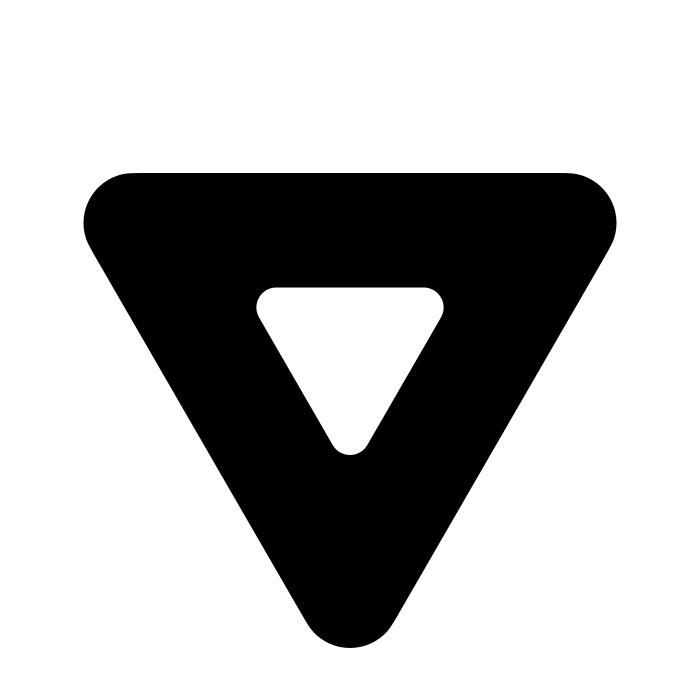

<div align="center">
  
  <h1>Vennor Icons</h1>
  <p>A beautiful, open-source collection of SVG icons for React Native and Expo applications</p>

  [](https://opensource.org/licenses/MIT)
  [](https://www.npmjs.com/package/vennor-icons)
</div>

---

## Features

- **23+ carefully crafted icons** designed for modern mobile applications
- **Outline and Solid variants** for flexible design systems
- **React Native & Expo optimized** with full TypeScript support
- **Lightweight** - Pure SVG with no dependencies
- **Tree-shakeable** - Import only what you need
- **MIT Licensed** - Free for personal and commercial use

## Installation

```bash
# npm
npm install vennor-icons

# yarn
yarn add vennor-icons

# pnpm
pnpm add vennor-icons
```

### Peer Dependencies

This package requires the following peer dependencies:
- `react` >= 16.8.0
- `react-native` >= 0.59.0

### Setup for React Native

To use SVG icons in React Native, you'll need to install `react-native-svg`:

```bash
npm install react-native-svg
```

For Expo projects:

```bash
npx expo install react-native-svg
```

## Usage

### Basic Usage

```javascript
import { HouseMediumOutline, SearchMediumSolid } from 'vennor-icons';
import { SvgXml } from 'react-native-svg';

function MyComponent() {
  return (
    <View>
      <SvgXml xml={HouseMediumOutline} width="24" height="24" />
      <SvgXml xml={SearchMediumSolid} width="24" height="24" />
    </View>
  );
}
```

### With react-native-svg Components

```javascript
import { PersonMediumOutline } from 'vennor-icons';
import { SvgXml } from 'react-native-svg';

function ProfileIcon({ size = 32, color = '#000' }) {
  return (
    <SvgXml
      xml={PersonMediumOutline}
      width={size}
      height={size}
      fill={color}
    />
  );
}
```

### Import All Icons

```javascript
import icons from 'vennor-icons';

// Access any icon
const homeIcon = icons.HouseMediumOutline;
const searchIcon = icons.SearchMediumSolid;
```

### TypeScript Support

Full TypeScript definitions are included:

```typescript
import { IconModule, HouseMediumOutline } from 'vennor-icons';

const icon: IconModule = HouseMediumOutline;
```

## Available Icons

### Navigation & UI
| Icon | Name | Variants |
|------|------|----------|
| 🏠 | House | `HouseMediumOutline`, `HouseMediumSolid` |
| 🔍 | Search | `SearchMediumOutline`, `SearchMediumSolid` |
| ⚙️ | Settings | `SettingsMediumOutline` |
| 📥 | Inbox | `InboxMediumOutline`, `InboxMediumSolid` |

### User & People
| Icon | Name | Variants |
|------|------|----------|
| 👤 | Person | `PersonMediumOutline`, `PersonMediumSolid` |
| 👥 | People | `PeopleMediumOutline`, `PeopleMediumSolid` |
| ➕ | Person Plus | `PersonPlusMediumOutline` |
| ➖ | Person Minus | `PersonMinusMediumOutline` |
| ⭐ | Person Star | `PersonStarMediumOutline` |

### Time & Calendar
| Icon | Name | Variants |
|------|------|----------|
| 📅 | Calendar | `CalenderMediumOutline`, `CalenderMediumSolid` |
| 🕐 | Clock | `ClockMediumOutline` |

### Security & Access
| Icon | Name | Variants |
|------|------|----------|
| 🔒 | Lock | `LockMediumSolid` |
| 🔑 | Key | `KeyMediumOutline` |
| 📱 | QR Code | `QrcodeMediumOutline` |

### Other
| Icon | Name | Variants |
|------|------|----------|
| 💳 | Wallet | `WalletMediumOutline` |
| 🎁 | Gift Box | `Giftbox` |

## Icon Naming Convention

Icons follow a consistent naming pattern:

```
[Name][Size][Variant]
```

- **Name**: Descriptive name (e.g., `House`, `Person`, `Search`)
- **Size**: Currently all icons are `Medium` sized
- **Variant**: `Outline` or `Solid` (some icons have only one variant)

## Styling Icons

### Changing Size

```javascript
<SvgXml xml={HouseMediumOutline} width="32" height="32" />
```

### Changing Color

Most outline icons can be recolored:

```javascript
<SvgXml xml={PersonMediumOutline} width="24" height="24" fill="#FF5733" />
```

### Adding Custom Styles

```javascript
import { View, StyleSheet } from 'react-native';

<View style={styles.iconContainer}>
  <SvgXml xml={SearchMediumSolid} width="24" height="24" />
</View>

const styles = StyleSheet.create({
  iconContainer: {
    padding: 8,
    backgroundColor: '#f0f0f0',
    borderRadius: 8,
  },
});
```

## Contributing

We welcome contributions! Here's how you can help:

### Adding New Icons

1. **Fork the repository**
2. **Create your icon** following these guidelines:
   - SVG format
   - Clean, optimized paths
   - Consistent sizing (preferably 24x24 or 32x32 viewBox)
   - Follow the naming convention: `icon-name-size-variant.svg`
3. **Add to `index.js`**:
   ```javascript
   YourIconName: require('./your-icon-name.svg'),
   ```
4. **Add TypeScript definition** in `index.d.ts`
5. **Update README** with your new icon
6. **Submit a pull request**

### Icon Design Guidelines

- Use a consistent stroke width (2px recommended)
- Maintain clean, simple designs
- Provide both outline and solid variants when possible
- Optimize SVG code (remove unnecessary attributes)
- Test on both iOS and Android

### Bug Reports

Found a bug? Please open an issue with:
- Description of the problem
- Steps to reproduce
- Expected vs actual behavior
- Screenshots if applicable

## Development

```bash
# Clone the repository
git clone https://github.com/VennorLTD/Vennor-Icons.git

# Navigate to directory
cd Vennor-Icons

# Install dependencies
npm install

# Make your changes and test
```

## License

MIT License - feel free to use this in personal and commercial projects.

See [LICENSE](LICENSE) for more information.

## Support

- **Website**: [vennor.co.za](https://vennor.co.za)
- **Issues**: [GitHub Issues](https://github.com/VennorLTD/Vennor-Icons/issues)
- **Discussions**: [GitHub Discussions](https://github.com/VennorLTD/Vennor-Icons/discussions)

## Roadmap

- [ ] Add more icon variants (Small, Large sizes)
- [ ] Animated icon components
- [ ] React web support
- [ ] Icon preview gallery
- [ ] Figma design file
- [ ] Dark mode optimized variants

## Acknowledgments

Created with care for the React Native and Expo community.

---

<div align="center">
  Made with ❤️ by the Vennor Icons team
  <br />
  <sub>Star this repo if you find it useful!</sub>
</div>
